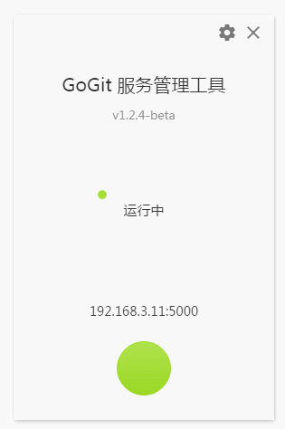

## 说明
Gogit 是 Gogs 的守护进程可视化客户端。
使用之前先下载好 [Gogs](https://gogs.io/)，之后启动应用，配置 gogs.exe 的路径和端口。

实际上它的效果等效于命令行：
```bash
./gogs.exe web --port 5000
```



#### 编译

``` bash
# install dependencies
npm install

# serve with hot reload at localhost:9080
npm start

# build electron application for production
npm run build
```

添加到 windows 启动项里
```bash
C:\Users\Administrator\AppData\Roaming\Microsoft\Windows\Start Menu\Programs\Startup
```
