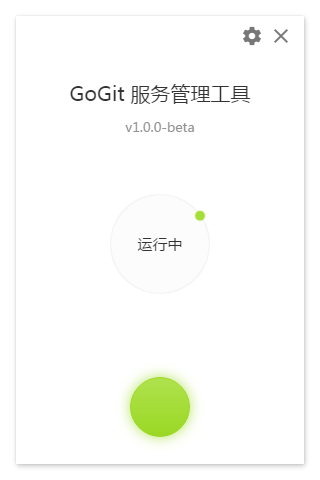

## gogit
gogit 守护进程可视化客户端。



#### Build Setup

``` bash
# install dependencies
npm install

# serve with hot reload at localhost:9080
npm start

# build electron application for production
npm run build
```

